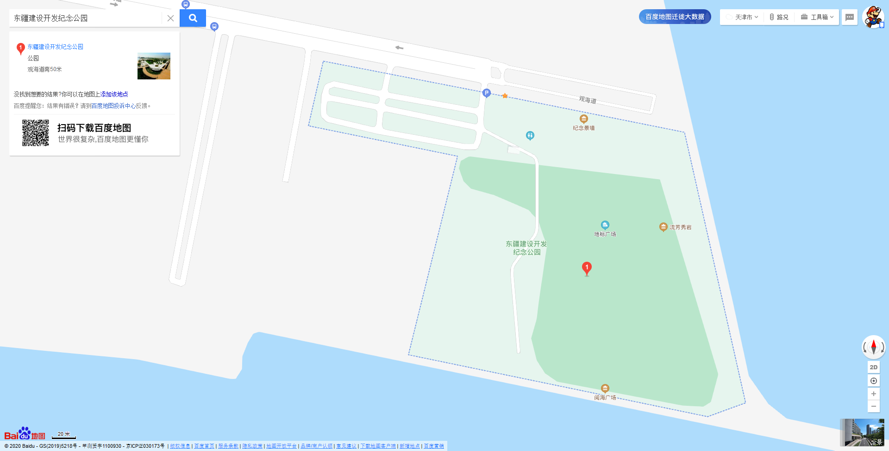
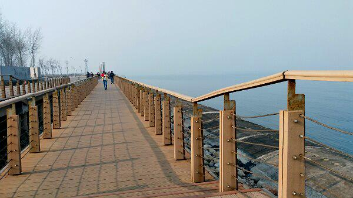
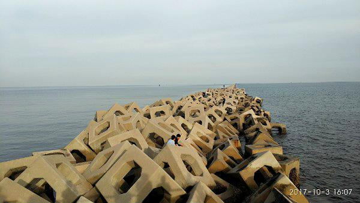
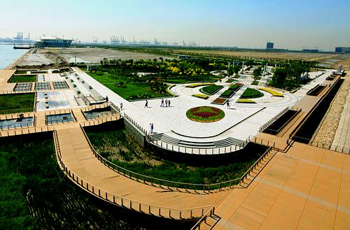

# 东疆纪念公园

## 地图位置
[百度地图](https://map.baidu.com/poi/%E4%B8%9C%E7%96%86%E5%BB%BA%E8%AE%BE%E5%BC%80%E5%8F%91%E7%BA%AA%E5%BF%B5%E5%85%AC%E5%9B%AD/@13118031.134680731,4692026.35,19z?uid=6563ce820ba930b16e20b9bc&ugc_type=3&ugc_ver=1&device_ratio=1&compat=1&querytype=detailConInfo&da_src=shareurl)

## 地图平面图

## 环境概况
### 东侧回廊

### 南侧回廊

### 防波堤

### 其他

## 环境分析
### 地面
1. 原木暖色调地板
1. 灰绿相间地砖
1. 海面
1. 东侧有水泥质感防波堤

### 侧立面
1. 绿植
1. 原木色扶手栏杆（部分钢丝绳）
1. 南侧有码头、船舶
1. 南侧夜景有灯光

### 气象条件
1. 比市区风大
1. 比市区温度低

## 拍摄设想
1. 冷暖对比色调 （原木质感地板栏杆和海面）
1. 冷暖对比色调 （原木质感地板栏杆和天空）
1. 极简风格（栏杆、天空、海面）
1. 南侧回廊可拍摄远眺
1. 南侧码头有揽桩，拍摄背影
1. 栏杆钢丝绳可拍摄情绪人像

## 特殊器材
1. 晴天ND镜减光可使用更大光圈
1. 使用CPL削减海面反光

## 拍摄道具
1. 风车
1. 泡泡机