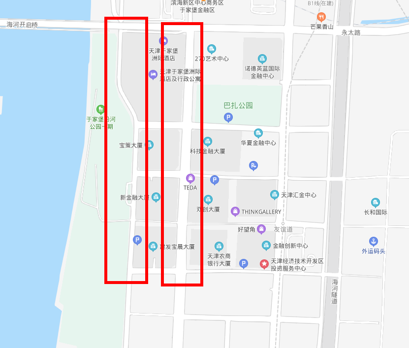

# 于家堡商务区

## 地图位置
[百度地图](https://map.baidu.com/@13101338.92512435,4694877.1205423465,17.22z)

## 地图平面图

## 环境概况
### 左侧街道沿河景观
.png)
.png)
.png)
### 右侧街道建筑景观
.png)
.png)
.png)
.png)
.png)

## 环境分析
### 地面
1. 柏油路
1. 地砖
1. 斑马线

### 侧立面
1. 水泥
1. 墙砖
1. 玻璃

### 气象条件
1. 高层建筑下风较大
1. 高层建筑密集，环境光变化大

## 拍摄设想
1. 极简的环境人像
1. 街景人像
1. 俯拍斑马线背景人像
1. 硬核

## 特殊器材
1. 三脚架 用于拍摄二次曝光，长曝光
1. cpl消减玻璃反光